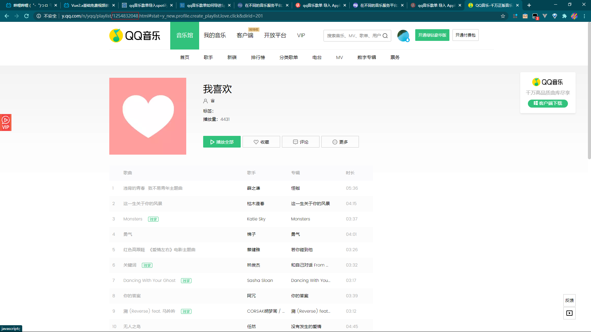
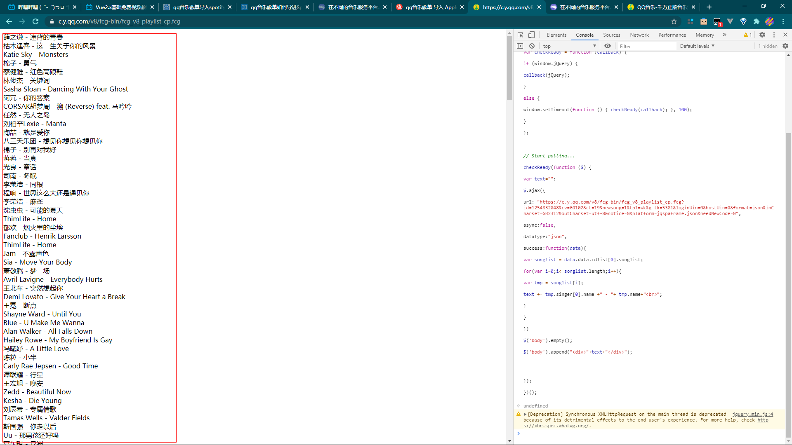

> 获取歌单

浏览器打开[链接](https://go.smzdm.com/e58d270f2e98fc53/ca_bb_yc_7_70198952_10869_0_11_0)

获取歌单ID如图

打开应该是一个空白页，然后打开浏览器开发者工具（Mac一般是command+shift+i，Windows一般是F12

将歌单ID替换后然后输入如下代码

```javascript
(function () {

// Load the script

var script = document.createElement("SCRIPT");

script.src = 'https://apps.bdimg.com/libs/jquery/2.1.4/jquery.min.js';

script.type = 'text/javascript';

document.getElementsByTagName("head")[0].appendChild(script);


// Poll for jQuery to come into existance

var checkReady = function (callback) {

if (window.jQuery) {

callback(jQuery);

}

else {

window.setTimeout(function () { checkReady(callback); }, 100);

}

};


// Start polling...

checkReady(function ($) {

var text="";

$.ajax({

url: "https://c.y.qq.com/v8/fcg-bin/fcg_v8_playlist_cp.fcg?id=<歌单ID>&cv=60102&ct=19&newsong=1&tpl=wk&g_tk=5381&loginUin=0&hostUin=0&format=json&inCharset=GB2312&outCharset=utf-8&notice=0&platform=jqspaframe.json&needNewCode=0",

async:false,

dataType:"json",

success:function(data){

var songlist = data.data.cdlist[0].songlist;

for(var i=0;i< songlist.length;i++){

var tmp = songlist[i];

text += tmp.singer[0].name +" - "+ tmp.name+"<br>";

}

}

})

$('body').empty();

$('body').append("<div>"+text+"</div>");


});

})();


```

然后将歌单部分复制，如图

进入这个[网站](https://www.tunemymusic.com/zh-cn/)，根据网站指示操作就可以了，来源选文本，内容就是刚刚复制的内容


也可以使用此方法[链接](https://sspai.com/post/60092)